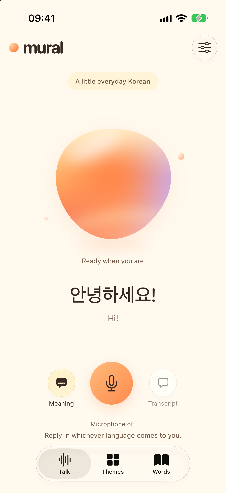
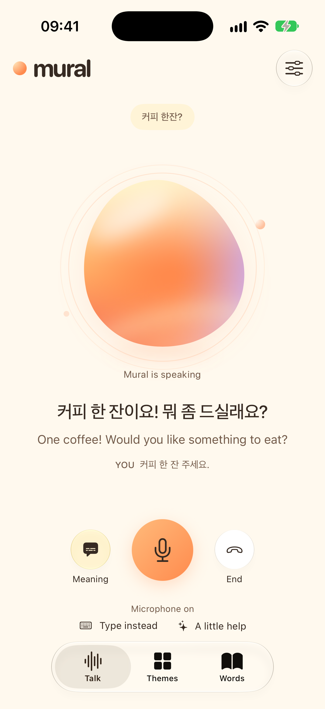
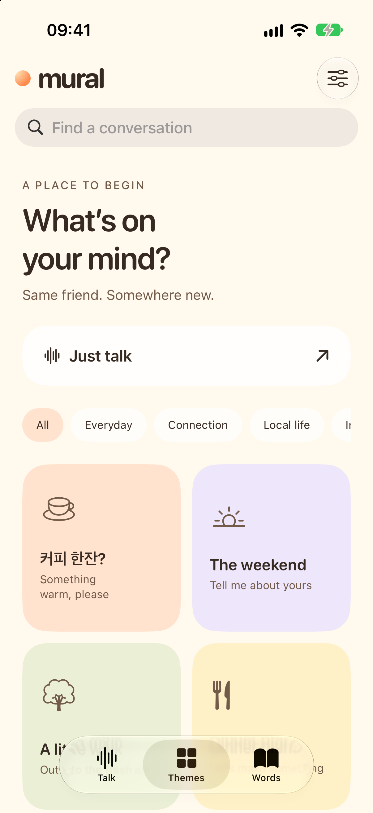
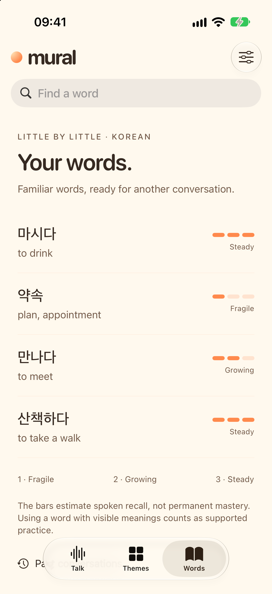

# Mural

**The language app you eventually delete.**

<p align="center">
  
  
  
  
</p>

Mural is a native iPhone app for learning through conversation. Speak to a warm, animated orb, follow the meaning when you need it, and practise words again in later conversations. Mural adjusts the challenge from the evidence in your replies.

Built with SwiftUI and Liquid Glass on iPhone. Learning records stay on your device. This version connects directly to OpenAI using your own API key. It needs an internet connection, but no Mural account or running Mac.

## Get started

You need a Mac with Xcode 26 or later, an iPhone running iOS 26.1 or later, an Apple Account, and an OpenAI API project with billing and access to GPT-Live-1 and GPT-5.6 Luna. A ChatGPT subscription does not provide API credit.

### Install with a local AI agent

If Codex or another coding agent has access to your Mac's files and terminal, paste the prompt below. The agent can clone, build and install Mural. You handle Apple Account sign-in and team selection in Xcode, device trust and Developer Mode prompts, and API-key entry inside the app. The [iPhone installation guide](docs/run-on-iphone.md) covers each step.

```text
Help me build and install Mural on my iPhone from https://github.com/Chuloo/mural.

Clone the repository into a new local folder, or use this checkout if it is
already open. Read README.md, docs/run-on-iphone.md and docs/build-and-test.md.
Check that Xcode and its iOS tools are ready, resolve the pinned dependencies,
run the offline core tests, and build the iOS Simulator target.

Guide me through adding my Apple Account and choosing my signing team in
Xcode. For a first installation, help me choose a unique bundle identifier if
needed. Preserve the existing team and identifier when updating Mural, and
do not uninstall it or erase its learning data.

Detect my connected iPhone, build with the configured signing team, install
Mural and launch it. Tell me when I need to unlock the phone, trust this Mac
or the developer profile, enable Developer Mode, or approve a system prompt.

I will choose my learning and subtitle languages, then enter my own OpenAI
API key in Settings > Advanced > Use your own API key. Do not ask me to paste
the key into chat, read it from Keychain, or put it in source files or logs.
Leave managed accounts, hosted trials and purchases disabled.

Finish by reporting which build and installation checks passed, and anything
I still need to do on the phone. I will start the first live conversation.
```

### Install with Xcode

Updating an earlier checkout? The iPhone project now lives in `apps/ios/`. Before opening it, follow the [local-settings migration steps](docs/run-on-iphone.md#update-an-earlier-checkout) to preserve your signing team, account configuration and existing app identity.

1. Clone [Chuloo/mural](https://github.com/Chuloo/mural), or download its ZIP. Open `apps/ios/Mural.xcodeproj`.
2. In Xcode, open **Settings → Accounts** and add your Apple Account.
3. Select the **Mural** target, open **Signing & Capabilities**, enable automatic signing, and choose your team. For your own fork, replace the bundle identifier with a unique value such as `com.yourname.mural`. Keep that value stable for later updates.
4. Connect and unlock your iPhone. Trust the Mac if prompted. Turn on **Settings → Privacy & Security → Developer Mode** on the phone, restart, and confirm the setting.
5. Select **Mural** as the scheme and your iPhone as the destination, then click **Run**. If iOS asks you to trust the developer, do so in **Settings → General → VPN & Device Management**.
6. Choose your learning language, your level and your subtitle language in the welcome screens. In **Settings → Advanced → Use your own API key**, save your own OpenAI project key. Start a conversation and allow microphone access.

You should hear Mural greet you in your chosen language. You can now disconnect your phone from the Mac and use Wi-Fi or cellular.

A free Personal Team can run the app on your own phone; TestFlight and App Store distribution require Apple Developer Program membership. Free provisioning profiles expire after seven days. Refresh by running the same project again, preserving the team and bundle identifier. Export a learning backup before changing either or switching phones. See the [detailed iPhone guide](docs/run-on-iphone.md) for common setup problems. [Apple membership guidance](https://developer.apple.com/support/compare-memberships/)

## What works today

- **A warm welcome:** choose a learning language, how much of it you want, and a subtitle language in three short screens, with a greeting that changes languages.
- **Your level:** *Starting out* has Mural explain in your subtitle language and teach one short phrase at a time; *Finding my feet* keeps the target language leading with a few words of help; *In at the deep end* is target language only. Change it at any time in Settings; a running conversation follows immediately.
- **Speaking pace:** slow, gentle, natural or brisk. The provider slows the generated voice, and Mural is asked to phrase things more slowly to match. A new pace applies to your next conversation.
- **Conversation practice:** live voice, gentle corrections, optional meaning subtitles, word lookup, mute, and a typed reply when speaking is inconvenient.
- **Saved phrases:** when Mural uses a phrase, tap it under the caption to keep it — or **Save all**. Kept phrases are read in **Words → Saved phrases**, the target language first with its meaning underneath. A notebook, not a measure of recall: saving changes no word and no bar.
- **Themes:** 24 conversation settings, with cultural details supplied by each language module. You can also request a current topic; web search supplies source links.
- **Adaptive practice:** vocabulary and provisional ability observations come from validated conversation evidence. Each learning language keeps separate progress.
- **Recall bars:** one to three bars summarise repeated retrieval over time. Three bars require spaced evidence in different contexts. These are product heuristics, not calibrated forgetting probabilities or a language certificate.
- **A fresh start:** the Talk screen returns to its greeting 15 seconds after a conversation ends. Tap **New conversation** to reset immediately. Your saved conversations and learning remain.
- **Local records:** export or import a JSON learning backup, delete a conversation, or delete all learning data from Settings.

The modules teach Korean as spoken in Seoul and Standard Japanese. Each language has its own conversation themes, teaching guidance and progress. Valid regional alternatives are accepted, and the interface itself stays in English.

Japanese includes optional romaji in Talk, transcripts and word details, and its word lookup uses dictionary word boundaries because Japanese is written without spaces. Korean needs neither: Hangul is written with spaces and sounds out letter by letter. Romaji comes from system dictionary readings, so it is a sounding-out aid rather than a pronunciation guide — kanji with more than one reading, long vowels and pitch accent still need listening checks. Voice accent and teaching guidance are model instructions, and fluent-speaker review is still needed before making pronunciation or learning-effectiveness claims.

## Privacy and API costs

Mural stores conversations, vocabulary and preferences on your device. There is no Mural cloud sync, analytics SDK or advertising. The optional iPhone account feature stores signup data on the account service; conversations and vocabulary stay local. Your API key is stored in the device’s Keychain, excluded from learning exports, and sent only to OpenAI.

During practice, audio, selected conversation text, learning context and requested searches go to OpenAI. Mural does not save raw audio. API requests set `store: false` where supported, but that does not disable all provider retention; OpenAI’s abuse-monitoring rules and your project’s settings still apply. [OpenAI data controls](https://developers.openai.com/api/docs/guides/your-data)

OpenAI bills your project for voice, text and search. The app’s usage display is an estimate, and its conversation time limit is not a billing cap. Check your OpenAI project’s usage and spending settings.

## Planned public service

Hosted free conversations and minute purchases are **not active**. Optional Google sign-in exists on iPhone. The [API foundation](services/api/README.md) contains identity verification, audited minute allowances and guest transfers, plus the earlier sandbox payment support. [Minute controls](docs/conversation-minutes.md) describe what is implemented and what remains disabled. Its runbook lists the remaining work before commercial activation. No shared provider key belongs in this repository or a distributed app binary.

A public TestFlight link and App Store listing are not yet available. [Release preparation](release/README.md) records the outstanding requirements.

The [Mural website](https://mural.chat) lives in the separate [Chuloo/mural-website repository](https://github.com/Chuloo/mural-website).

## Build and test

From the repository root:

```sh
swift test --package-path apps/ios
xcodebuild -project apps/ios/Mural.xcodeproj -scheme Mural \
  -destination 'generic/platform=iOS Simulator' \
  -derivedDataPath .build/DerivedData \
  CODE_SIGNING_ALLOWED=NO ARCHS=arm64 ONLY_ACTIVE_ARCH=YES build
```

For UI tests, create or select an iPhone 17 simulator in Xcode, then run **Product → Test**. The tests use in-memory fixtures and do not require an API key. More commands and preview options are in [the build guide](docs/build-and-test.md).

The Korean and Japanese build recorded on 17 September 2026 passed **73 core tests and 17 native UI tests** on an iPhone 17 simulator, covering both onboarding choices, Japanese word segmentation and optional romaji, Korean whitespace word links, language switching, and the largest accessibility text size. Neither module has had a live device check or a proficient-speaker review, so nothing here establishes speech recognition, pronunciation, correction quality or teaching effectiveness. [Verification record](verification/validation.md)

## Code map

| Directory | Contents |
| --- | --- |
| `apps/ios/App/` | SwiftUI views, SwiftData storage, Keychain, WebRTC transport and API coordination |
| `apps/ios/Core/` | Language modules, teaching policy, transcripts, vocabulary evidence and recall projection |
| `apps/ios/Tests/` | Core learning and translation tests |
| `apps/ios/UITests/` | Native interface tests |
| `shared/` | API contracts and learning-archive fixtures used by the core tests |
| `scripts/` | Xcode project generation and app-icon tooling |
| `docs/` | Setup, build and language-module guides |
| `release/` | Submission drafts and public-release checks |
| `services/api/` | Account, billing and hosted-service foundation; see its runbook before deploying |

Read [how the language architecture works](docs/language-architecture.md) and [how to add a language](docs/add-language.md). Contributions should follow [CONTRIBUTING.md](CONTRIBUTING.md); security issues belong in the [private reporting process](SECURITY.md).

## Dependencies and license

The native WebRTC package is pinned to [stasel/WebRTC 152.0.0](https://github.com/stasel/WebRTC/tree/152.0.0). The app bundles [third-party notices](apps/ios/App/ThirdPartyNotices.txt) and the SDK’s privacy manifest. Review upstream notices when changing the dependency.

Mural is released under the [MIT License](LICENSE). Third-party components retain their own licenses. The Mural name and logo identify the original project; the software license does not grant trademark rights.
